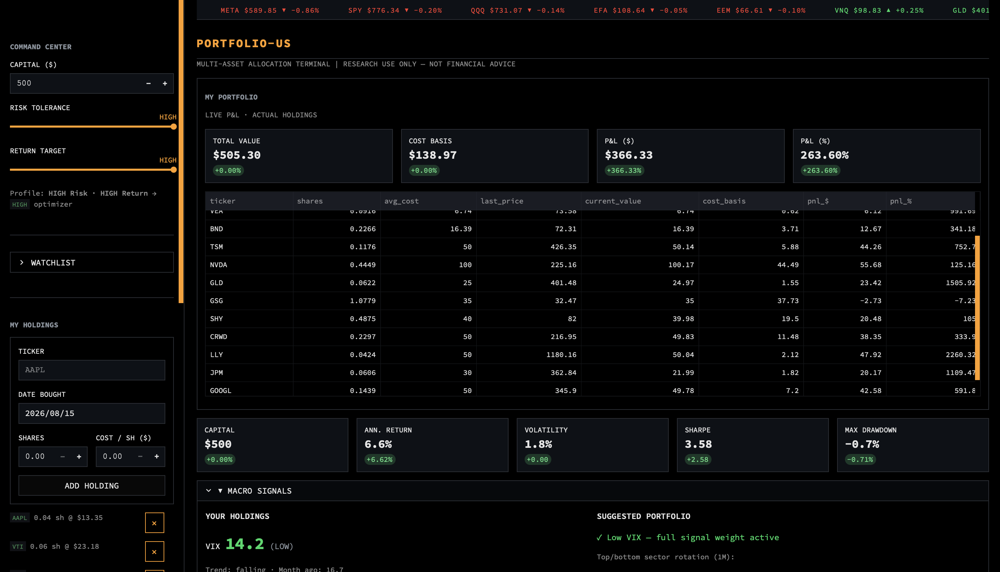
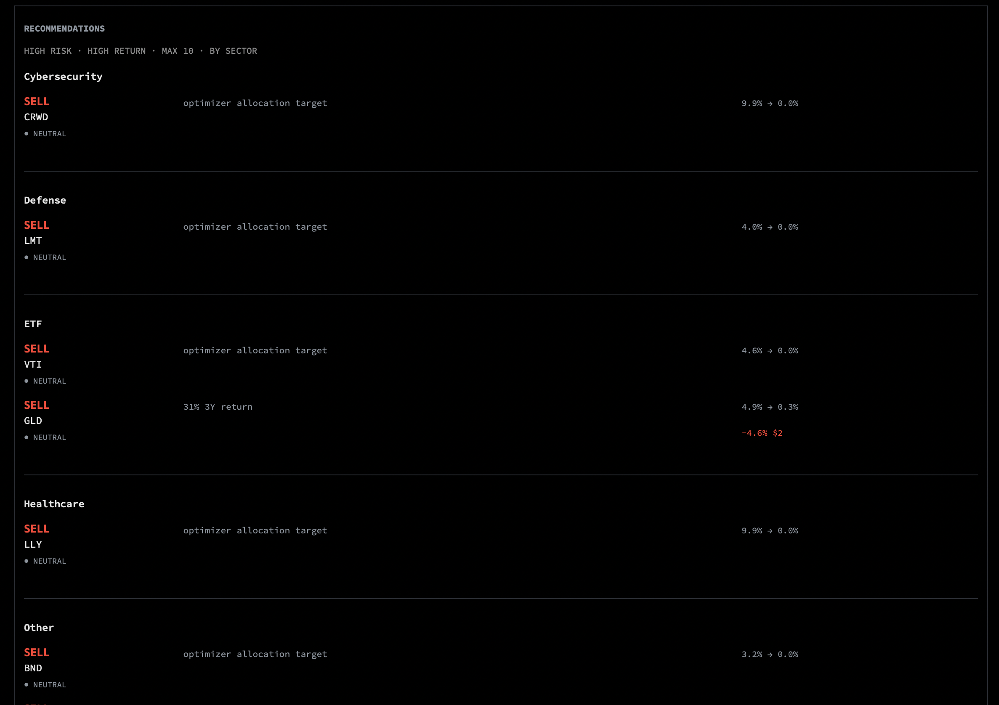
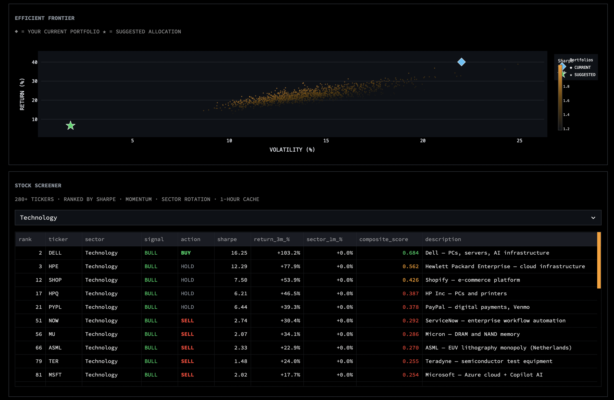
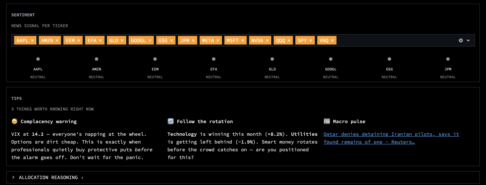

# portfolio-us

A Bloomberg-terminal-style multi-asset portfolio tracker built in Python + Streamlit. Pulls live market data, runs a mean-variance optimizer with macro signal overlays, and presents everything in a dense dark-mode dashboard.

  

---

## What it does

- **Portfolio tracker** — enter your actual holdings (ticker, shares, cost basis), see live P&L and value history
- **Optimizer** — mean-variance optimization (min-variance / max-Sharpe / blended) driven by a 3-year price window
- **Macro signal overlay** — VIX regime, sector momentum (SPDR ETFs), and news sentiment tilt expected returns before optimization; signals scaled back 50% in high-VIX regimes
- **Recommendations** — up to 10 BUY / SELL / TRIM / BUY MORE / HOLD signals grouped by sector, with inline 30-day ATM call prices (Black-Scholes)
- **Efficient frontier** — blue diamond = your current portfolio, gold star = suggested allocation
- **Stock screener** — 282 tickers across 18 sectors, scored by Sharpe + momentum + sector rotation, with BULL / BEAR / NEUTRAL signal and BUY / SELL / HOLD action columns; cached 1 hour independently
- **Sentiment badges** — BULLISH / BEARISH / NEUTRAL per ticker with a multiselect filter; powered by Finnhub
- **Macro signals panel** — VIX gauge split by your holdings vs suggested portfolio, top/bottom sector rotation
- **Tips** — 3 live tips: VIX hedge advice, sector rotation signal, and latest macro headline with link

---

## Dashboard layout


```
[Ticker tape]
[MY PORTFOLIO — P&L, value chart, positions table]
[Top metrics: Capital · Ann. Return · Volatility · Sharpe · Max Drawdown]
```



```
[▼ MACRO SIGNALS — your holdings VIX | suggested portfolio context]
[RECOMMENDATIONS — BUY/SELL/TRIM/HOLD · sector groups · inline options]
```



```
[EFFICIENT FRONTIER — current ◆ vs suggested ★]
[STOCK SCREENER — 282 tickers · sector filter · BULL/BEAR/BUY/SELL]
```



```
[SENTIMENT — badge grid with ticker picker]
[TIPS — VIX hedge · sector rotation · macro article]
[▶ ALLOCATION REASONING — optimizer decision log]
```



---

## Quick start

```bash
git clone <repo>
cd portfolio-us
python -m venv port-env
source port-env/bin/activate       # Windows: port-env\Scripts\activate
pip install -r requirements.txt

cp .env.example .env               # add your API keys
streamlit run app.py
```

Open [http://localhost:8501](http://localhost:8501).

---

## API keys

| Key | Required | Used for |
|-----|----------|----------|
| `FINNHUB_API_KEY` | Optional | News, sentiment, macro headlines |
| `FRED_API_KEY` | Optional | US Treasury yield curve |
| `ALPACA_API_KEY` + `ALPACA_SECRET_KEY` | Optional | Live options chains (OPRA) |

Without API keys the app still runs — it falls back to price-data-only mode (yfinance, free).

---

## Risk × Return profiles

The sidebar exposes two independent sliders that combine into an optimizer mode:

| Risk Tolerance | Return Target | Optimizer mode |
|---|---|---|
| LOW | LOW | Min-variance (capital preservation) |
| LOW | HIGH | Blended (max return within low-vol budget) |
| MEDIUM | LOW | Min-variance (cautious) |
| MEDIUM | HIGH | Max-Sharpe (growth-oriented) |
| HIGH | LOW | Blended (aggressive budget, moderate return push) |
| HIGH | HIGH | Max-Sharpe + full signal overlay |

---

## Project structure

```
portfolio-us/
├── app.py                  # Streamlit dashboard (main entry point)
├── agents/
│   ├── orchestrator.py     # Full pipeline: prices → signals → allocate → metrics
│   └── recommendations.py  # (legacy) card-style recommendation generator
├── allocation/
│   └── optimizer.py        # Mean-variance optimizer (scipy SLSQP) + signal overlay
├── data/
│   ├── fetch.py            # yfinance OHLCV download + local cache
│   ├── bonds.py            # FRED Treasury yields + bond ETF proxies
│   ├── macro.py            # VIX, sector momentum, earnings calendar, macro news
│   ├── news.py             # Finnhub news + sentiment summary (30-day window)
│   ├── options.py          # Alpaca live options chains
│   ├── portfolio.py        # Holdings P&L and value history
│   ├── screener.py         # 282-ticker screener with signal + action columns
│   └── holdings_store.py   # Persist holdings to data/.holdings.json
├── metrics/
│   ├── returns.py          # Daily + cumulative returns
│   ├── risk.py             # Sharpe, Sortino, max drawdown, correlation
│   └── options_metrics.py  # Black-Scholes ATM summary (price + Greeks)
├── ui/
│   ├── theme.py            # Bloomberg-terminal CSS + ticker tape + helpers
│   └── charts.py           # Plotly chart helpers (frontier, heatmap, etc.)
├── .env.example
├── .gitignore
├── requirements.txt
└── CLAUDE.md
```

---

## Data sources

- **Prices** — [yfinance](https://github.com/ranaroussi/yfinance) (Yahoo Finance, free, 3-year window)
- **News / Sentiment** — [Finnhub](https://finnhub.io) (free tier, 30-day window)
- **Treasury yields** — [FRED](https://fred.stlouisfed.org) (free)
- **Options chains** — [Alpaca Market Data](https://alpaca.markets) (OPRA subscription needed for live Greeks)

---

> **Research use only — not financial advice.**
